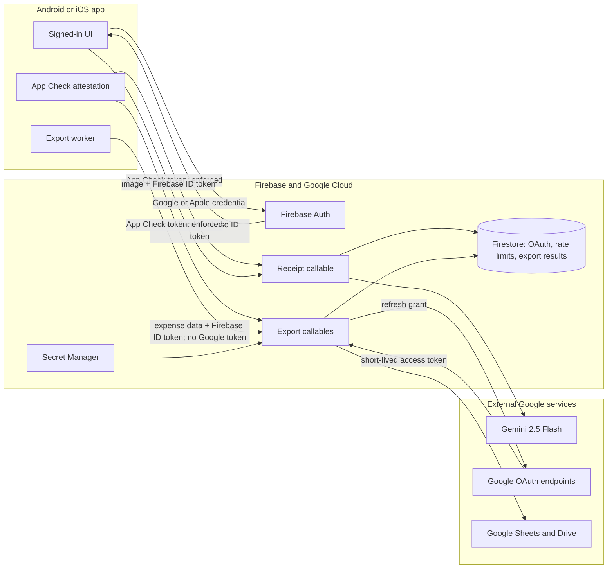
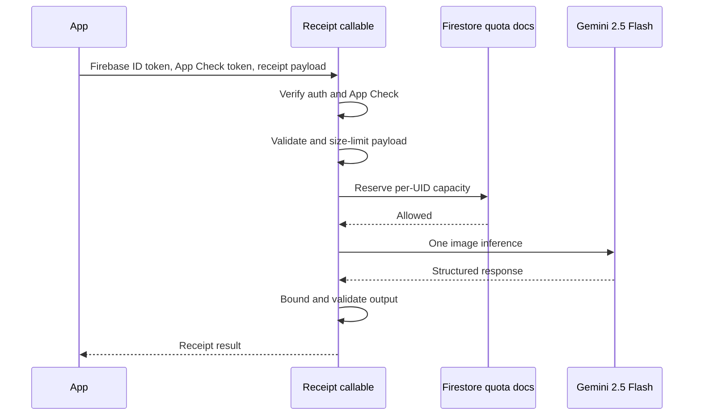
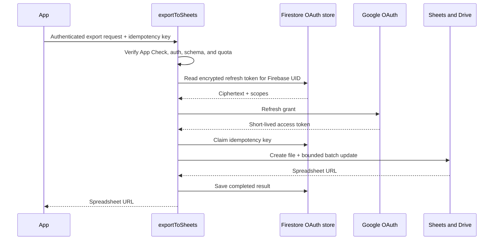
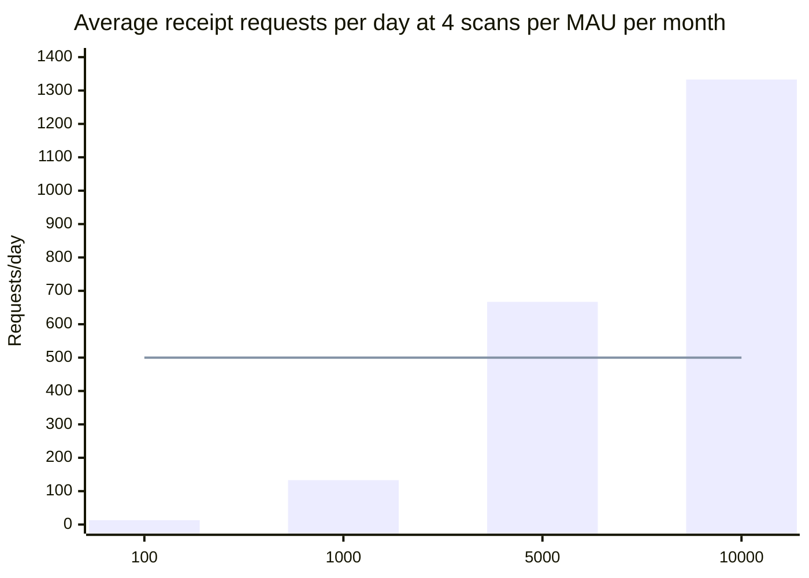

# Cloud Functions security, efficiency, and cost review

**Review date:** 2026-07-12  
**Project:** `pleasest-e3424`  
**Region:** `europe-west1`  
**Decision:** source-level remediations are implemented. Production remains blocked only on the external App Check,
provider, secret, deployment, monitoring, and physical-device steps in [Production setup TODO](../TODO.md).

## Scope and evidence

This review covers:

- TypeScript functions in `functions/src/`;
- Python callables in `functions-py/main.py`;
- Firestore rules and server-side collections;
- Firebase callable authentication, App Check, OAuth token custody, FCM, and Google Sheets calls;
- the live function inventory returned by Firebase CLI 15.23.0 on 2026-07-12;
- estimated monthly platform cost at 100, 1,000, 5,000, and 10,000 monthly active users (MAU).

The review did not read secret values, perform penetration testing, inspect IAM bindings, or download deployed source revisions. Therefore, the live inventory can be compared with the repository, but the exact code revision behind each deployed function cannot be proven by this review.

There is no production-data migration in scope. The project has no real users, so the recommendation is a clean production launch after the final schema, secrets, functions, and App Check configuration are deployed and verified.

## Executive summary

The architecture has several good foundations: all callable business operations require Firebase authentication in repository code, refresh tokens are encrypted before Firestore storage, access tokens exist only in function memory, Firestore client access is denied by default, receipt payloads are size-checked, and Sheets writes are batched.

The original review identified four release blockers:

1. The Node production dependency audit reports one critical, four high, thirteen moderate, and one low vulnerability. The critical path includes `protobufjs`; `firebase-admin` also requires a major-version update to clear its reported dependency chain.
2. App Check is disabled on both receipt functions and is not enforced on the Python callables. A valid Firebase user account alone is currently enough to call cost-generating endpoints from an unofficial client.
3. `analyzeReceiptGemini` increments its global counter before checking Firebase authentication or validating the request. Calls without a signed-in user can consume the complete 500-request daily capacity.
4. The live deployment does not contain the repository's Google link/status/unlink callables or the auth-deletion cleanup trigger. The secure OAuth lifecycle described by the source is therefore not yet the verified live lifecycle.

At the requested scales, Firebase and Google Sheets infrastructure is inexpensive; receipt AI inference is the dominant variable cost. Under the baseline workload in this document, expected monthly cost is approximately **$0.70, $7, $35, and $73** for 100, 1,000, 5,000, and 10,000 MAU respectively. These are planning estimates, not billing guarantees.

### Remediation update

All source-level P0 and P1 actions in this review were implemented on 2026-07-12: App Check initialization/enforcement,
authentication-first quota ordering, UID quotas, Python scaling ceilings, strict export validation, idempotency, formula
separation, body-based OAuth revocation, revocation during deletion cleanup, bounded Sheets retries, FCM export-channel
removal, output bounds, and structured operational metrics. The app now selects paid Vertex AI for normal receipt
analysis. Node production audit has no critical/high findings; the remaining mutually constrained findings are moderate.
Python pins were updated to remove the reported cryptography and requests advisories.

## Architecture and trust boundaries



The Firebase ID token proves who is calling. App Check should additionally establish that the call came from an attested PlzStop app instance. These controls are complementary; Firebase documents that callable SDKs attach available Auth and App Check tokens and the callable runtime validates them.

## Live deployment compared with repository

The Firebase CLI returned these deployed functions:

| Function | Generation | Trigger | Runtime | Memory |
|---|---:|---|---|---:|
| `analyzeReceipt` | v2 | callable | Node.js 22 | 512 MiB |
| `analyzeReceiptGemini` | v2 | callable | Node.js 22 | 512 MiB |
| `exportToSheets` | v2 | callable | Python 3.13 | 256 MiB |
| `rateLimitCleanup` | v2 | scheduled | Node.js 22 | 256 MiB |

Repository functions not present in that inventory:

- `linkGoogleAccount`;
- `hasGoogleAccountLink`;
- `unlinkGoogleAccount`;
- `cleanupGoogleOAuthOnUserDelete`.

This is deployment drift, not a data-migration problem. Deploy the complete reviewed release atomically enough that clients do not begin using a partially available OAuth contract, then smoke-test each callable in production with test accounts.

## Security findings

The following tables preserve the evidence found during the review. SEC-01 through SEC-13 are remediated in repository
source. SEC-05 still requires deployment verification, and SEC-02 still requires Firebase/Apple/Play console setup and
registered debug tokens before the enforcing source can be deployed safely.

### P0 — production blockers

| ID | Finding | Impact | Evidence | Required action |
|---|---|---|---|---|
| SEC-01 | Production dependency audit is not clean | A vulnerable transitive parser/runtime can create code-execution or denial-of-service exposure depending on reachability | `npm audit --omit=dev` reports 19 findings: 1 critical, 4 high, 13 moderate, 1 low; the critical package is `protobufjs` | Upgrade supported direct dependencies, including the required `firebase-admin` major update, regenerate the lockfile, build/test, and require a clean or explicitly accepted audit before deployment |
| SEC-02 | App Check is not enforced | Stolen accounts, scripted signups, or unofficial clients can invoke cost-bearing AI, OAuth, and export operations | `enforceAppCheck: false` in `functions/src/index.ts`; Python decorators do not set `enforce_app_check=True` | Integrate Android Play Integrity and Apple App Attest/DeviceCheck, monitor metrics, then enforce App Check on every callable; consider limited-use tokens for especially sensitive link/export operations |
| SEC-03 | Global Gemini quota is consumed before authentication and validation | An unauthenticated caller can exhaust all 500 daily calls and deny receipt scanning to every user | `checkGlobalDailyLimit()` runs before `prepareRequest()`, while the auth check is inside `prepareRequest()` | Check auth and App Check first, validate the payload second, apply the per-UID quota third, then reserve global capacity immediately before inference |
| SEC-04 | Python cost-bearing callables have no abuse quota or scaling ceiling | One authenticated account can repeatedly exchange codes, refresh tokens, create spreadsheets, and consume external API/project quotas | Python `on_call` decorators have no App Check, rate limit, `max_instances`, or explicit concurrency | Add per-UID and per-app quotas, idempotency, `max_instances`, explicit concurrency, and alerts before production |
| SEC-05 | The live OAuth lifecycle is incomplete and its deployed revision is not proven | Source-level token safeguards cannot be assumed to be active; account unlink and deletion cleanup are unavailable live | Firebase CLI inventory has only four functions and omits the new OAuth lifecycle functions | Deploy the reviewed source, verify function inventory/configuration, and run link/export/unlink/delete smoke tests before release |

### P1 — hardening and reliability

| ID | Finding | Impact | Recommended change |
|---|---|---|---|
| SEC-06 | Export input has no strict row schema, row-count cap, or field-length cap | Large or malformed uncompressed payloads can consume memory/CPU and produce oversized Sheets requests | Require a map payload; cap rows and text lengths; validate ISO dates, finite positive amounts, `tabLayout`, decimal range, title, `exportId`, and FCM token types before OAuth or Sheets work |
| SEC-07 | Client amount strings beginning with `=` become formulas | A crafted expense can place an executable formula in the resulting sheet | Parse and validate amounts as finite numbers before constructing cells; represent trusted internal formulas with a distinct server-only type |
| SEC-08 | Category text is interpolated into generated formulas with questionable quote escaping | Quotes or formula metacharacters can corrupt formulas and may permit spreadsheet formula injection | Avoid string interpolation where possible; otherwise use correct Sheets formula-string escaping and tests containing quotes, apostrophes, `=`, `+`, `-`, and `@` |
| SEC-09 | OAuth revocation sends the refresh token in the URL query | URLs are more likely than request bodies to appear in network or diagnostic logs | Send the token as a form-encoded POST body and continue logging only status/result classes, never tokens or authorization codes |
| SEC-10 | The client supplies any FCM registration token and receives the spreadsheet URL through it | A stale, copied, or mismatched token can disclose a user-specific URL to another device | Store FCM tokens under the verified UID or omit the URL from the push and require an authenticated result fetch |
| SEC-11 | Auth-deletion cleanup deletes ciphertext without attempting Google revocation | The local credential is destroyed, but the Google grant can remain active until Google expires or the user revokes it | Revoke before deletion when decryptable; retain deletion as a `finally` action. The explicit unlink-before-delete flow remains the primary path |
| SEC-12 | IP-only receipt rate limiting is neither identity-fair nor hard to evade | Users behind carrier/NAT IPs share a three-per-day limit, while an attacker can rotate addresses | Key the primary quota by Firebase UID and optionally use IP/app ID as secondary abuse signals |
| SEC-13 | Model output strings and item counts are not tightly bounded | Unexpected model output can return oversized or malformed merchant, currency, date, item names, or item arrays | Apply maximum lengths/counts, finite-number checks, ISO currency/date validation, and category/subcategory parent consistency |

### Controls that are already sound

- Every repository business callable checks `request.auth`/`req.auth` and derives the OAuth document key from the verified Firebase UID.
- The client does not send a Google refresh or access token to `exportToSheets`.
- Refresh tokens are stored as Fernet ciphertext and the encryption key/client secret are Secret Manager values.
- Access tokens are minted inside the export invocation and are not persisted.
- Firestore rules deny every client read and write, including `googleOAuthAccounts/{uid}`. Admin SDK access intentionally bypasses those rules.
- OAuth and Google API calls use network timeouts and token-related logs avoid token values.
- Receipt images are base64-validated and capped at 5 MiB.
- Text fields written directly as expense cells are protected against leading formula characters, except for the amount path noted above.
- `analyzeReceipt` and `analyzeReceiptGemini` have a ten-instance ceiling.

## Efficiency and scaling review

### Receipt analysis



The current implementation batches the AI work into one inference and uses a cached SDK model object, which is efficient. The 5 MiB image limit and ten-instance maximum provide useful upper bounds.

The app now calls paid Vertex `analyzeReceipt`, which retains the ten-instance cost ceiling without the repository's
500/day Developer API cap. The alternate `analyzeReceiptGemini` remains capped and is not the production client path.
Both functions now enforce App Check, authenticate, validate input, and reserve per-UID capacity before any shared
Developer API counter or model request. The per-UID transaction cost is negligible at the requested volumes.

### Google Sheets export



Positive efficiency choices:

- one refresh operation per export avoids persisting access tokens;
- one batch update per generated worksheet minimizes Sheets write calls;
- payloads over the client threshold can be gzip-compressed;
- the function stores a recovery result keyed by the required export ID.

Implemented scaling controls:

- the required export ID is claimed before `gc.create()`, completed retries return the stored URL, and stale leases recover;
- input is limited to 5,000 rows, 500 characters per text cell, and 2 MiB decompressed/encoded data;
- the Python export function uses 512 MiB, five maximum instances, and concurrency four;
- each UID is limited to ten exports per UTC day;
- retryable Sheets `429` and `5xx` failures receive bounded exponential server retries and a structured client retry reason;
- user-supplied values cannot become formulas, and summary formula literals use Sheets-compatible quote escaping.

Google Sheets currently permits 300 read and 300 write requests per minute per project and 60 per minute per
user/project. The configured ceilings materially reduce burst risk, but a production load test remains required.

## Monthly cost estimate

### Workload assumptions

The model uses monthly active users, not registered accounts:

- 4 receipt analyses per MAU/month;
- 1 Google Sheets export per MAU/month;
- 1 authoritative link-status read per export;
- 5% of MAU link or relink Google Sheets in a month;
- receipt function duration: 5 seconds at 1 vCPU and 512 MiB;
- export duration: 8 seconds at 1 vCPU and 512 MiB;
- status duration: 0.5 seconds; link duration: 2 seconds;
- Gemini 2.5 Flash baseline per receipt: 2,500 input tokens and 400 output tokens;
- Vertex/Gemini paid pricing baseline: $0.30 per million input tokens and $2.50 per million output tokens;
- no minimum instances, no unusual egress, and one billing account is consuming the free tiers.

Baseline AI cost per receipt:

```text
(2,500 / 1,000,000 × $0.30) + (400 / 1,000,000 × $2.50) = $0.00175
```

Actual image tokens and duration must be measured from production telemetry. Taxes, currency conversion, build/deployment storage, logging above free allowances, support, and future Sheets API charges are excluded.

### Baseline estimate using paid Gemini 2.5 Flash inference

| MAU | Receipt scans/month | Sheets exports/month | Estimated non-AI platform | Estimated AI | Estimated total/month |
|---:|---:|---:|---:|---:|---:|
| 100 | 400 | 100 | ~$0.00 | $0.70 | **$0.70** |
| 1,000 | 4,000 | 1,000 | ~$0.00 | $7.00 | **$7.00** |
| 5,000 | 20,000 | 5,000 | ~$0.00 | $35.00 | **$35.00** |
| 10,000 | 40,000 | 10,000 | ~$2.55 | $70.00 | **$72.55** |

The 10,000-MAU compute estimate crosses the modeled Cloud Run request-based free CPU allowance: about 286,000 vCPU-seconds are modeled versus 180,000 free, producing roughly $2.55 at $0.000024/vCPU-second. Modeled memory, request count, and Firestore operations remain inside their respective free allowances. Free-tier credits are billing-account-wide, so another project can consume them first.

### AI-token sensitivity

| Scenario per receipt | Token assumption | Cost/receipt | 100 MAU | 1,000 MAU | 5,000 MAU | 10,000 MAU, including ~$2.55 platform |
|---|---|---:|---:|---:|---:|---:|
| Low | 1,500 input + 250 output | $0.001075 | $0.43 | $4.30 | $21.50 | $45.55 |
| Baseline | 2,500 input + 400 output | $0.00175 | $0.70 | $7.00 | $35.00 | $72.55 |
| High | 5,000 input + 800 output | $0.00350 | $1.40 | $14.00 | $70.00 | $142.55 |

If `analyzeReceiptGemini` remains on an eligible no-cost Gemini Developer API tier, AI charges may be $0 while its quota lasts. That does not make it a scalable production plan: the repository's own 500/day counter supports only about 3,750 MAU at four evenly distributed scans per month, and less under bursty traffic. At 5,000 and 10,000 MAU, use paid capacity or reduce scan frequency.

### Cost by service

| Service | Expected cost at requested tiers | Main constraint |
|---|---|---|
| Firebase Auth: Google/Apple | $0 for 100–10,000 MAU under the documented social-auth tiers | Identity Platform Blaze has a 50,000 MAU no-cost tier; phone auth is different |
| Cloud Run functions | Near $0 through 5,000 MAU; about $2.55 at 10,000 under modeled duration | Duration and CPU dominate; real latency must be measured |
| Firestore | $0 under the modeled operation rate | 50,000 reads/day, 20,000 writes/day, and 20,000 deletes/day free for one database |
| Vertex/Gemini inference | Dominant cost: baseline $0.00175/receipt | Image/output tokens and selected paid/free API tier |
| Google Sheets API | $0 for standard use at review time | 300 writes/min/project; pricing for quota excess is planned later in 2026 but is not yet quantified |
| Secret Manager | Expected $0 | Six active versions and 10,000 access operations/month are free per billing account; excess access is inexpensive |
| Cloud Scheduler | Expected $0 | Three jobs/month are free per billing account; one cleanup job is used |

## Capacity view



The line is the current `analyzeReceiptGemini` global daily ceiling. It is crossed between 1,000 and 5,000 MAU.

## Implementation status

Repository work is complete and no migration is required. Remaining work is external configuration and runtime
verification: register Android/Apple App Check providers and debug tokens, configure Auth/OAuth and secrets, deploy the
complete function set, create budgets/dashboards, and run signed-device and load tests. The executable checklist is in
[Production setup TODO](../TODO.md).

## Release gates

- `npm audit --omit=dev` has no unaccepted critical/high production findings.
- TypeScript build, Python tests, and Firestore rule tests pass.
- App Check enforcement is verified on Android and iOS; calls without valid attestation are rejected.
- Authentication and validation happen before any shared quota is consumed.
- Export has a per-UID quota, idempotency key, payload bound, explicit scaling ceiling, and transient retry policy.
- The deployed inventory includes all intended OAuth lifecycle functions and account-deletion cleanup.
- Link, export, retry, unlink, and account deletion are smoke-tested using non-production test accounts.
- Budget alerts exist for Cloud Run functions, Firestore, Secret Manager, and Vertex/Gemini usage.
- A load test demonstrates that expected peaks remain below the configured Sheets and AI quotas.

## Official pricing and security references

- [Firebase callable functions and automatic token handling](https://firebase.google.com/docs/functions/callable)
- [Firebase App Check enforcement for Cloud Functions](https://firebase.google.com/docs/app-check/cloud-functions)
- [Firebase pricing and Authentication tiers](https://firebase.google.com/pricing)
- [Cloud Run request-based pricing](https://cloud.google.com/run/pricing)
- [Cloud Firestore pricing and free quota](https://cloud.google.com/firestore/pricing)
- [Gemini Developer API pricing](https://ai.google.dev/gemini-api/docs/pricing)
- [Vertex AI generative model pricing](https://cloud.google.com/vertex-ai/generative-ai/pricing)
- [Google Sheets API quotas and pricing](https://developers.google.com/workspace/sheets/api/limits)
- [Secret Manager pricing](https://cloud.google.com/secret-manager/pricing)
- [Cloud Scheduler pricing](https://cloud.google.com/scheduler/pricing)
- [Firebase Cloud Messaging pricing](https://firebase.google.com/products/cloud-messaging)
