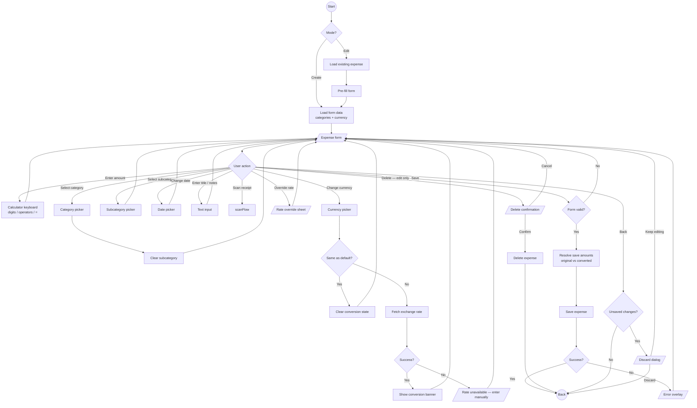
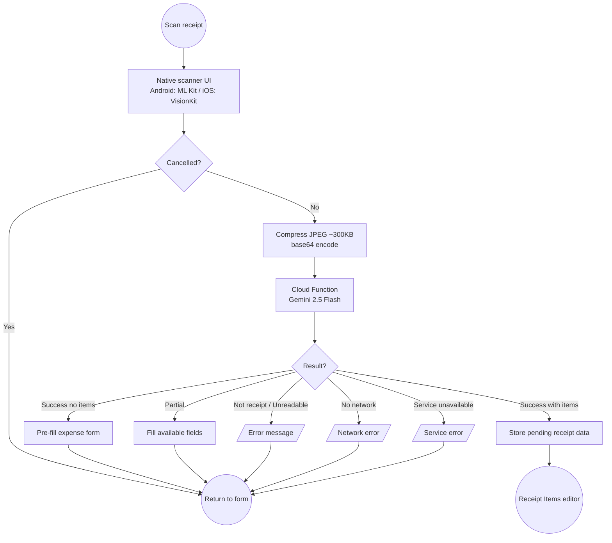

# Add / Edit Expense

## Purpose

Full-screen form for creating or editing an expense. Includes a built-in calculator keyboard, receipt scanning via AI, multi-currency support with exchange rate conversion, and two-tier category/subcategory assignment.

## Process Flow

### Create / Edit Expense



### Receipt Scan Sub-flow



## Modes

| Mode | Entry Point | Behaviour |
|------|-------------|-----------|
| Create | Home FAB or category card | Empty form, today's date |
| Edit | Monthly expenses list tap | Pre-filled form, delete available, unsaved-change tracking |

## Form Fields

| Field | Constraints | Required | Notes |
|-------|-------------|----------|-------|
| Amount | Calculator keyboard, currency-aware decimals | Yes | Supports math expressions (+, -, x, /) |
| Title | Max 60 chars | Yes | Auto-suggested tags based on selected category |
| Category | Picker from user's categories | Yes | Clears subcategory on change |
| Subcategory | Picker, filtered by parent category | No | Gated by `subcategories_enabled` feature flag |
| Date | Date picker, defaults to today | Yes | |
| Notes | Max 250 chars | No | |
| Currency | Picker (if conversion enabled) | No | Defaults to user's primary currency |

---

## Calculator Keyboard

### Layout

4 rows x 5 columns. Left column (operators), middle 3 columns (digits + currency symbol), right column (actions). Save/= button spans the bottom 2 rows vertically.

```
+---------+---------+---------+---------+----------+
|    /    |    7    |    8    |    9    |    <x    |
+---------+---------+---------+---------+----------+
|    x    |    4    |    5    |    6    |    Cal   |
+---------+---------+---------+---------+----------+
|    -    |    1    |    2    |    3    |          |
+---------+---------+---------+---------+   OK/=  |
|    +    |    $    |    0    |    ,    |          |
+---------+---------+---------+---------+----------+
```

- **Left column**: Operators `/`, `x`, `-`, `+`
- **Middle section**: Calculator-style digit pad. Bottom-left shows active currency symbol (display-only). Bottom-right is decimal separator.
- **Right column**: Backspace, Calendar (opens date picker), OK/= (spans 2 rows)

### Key types

```
NumericKey:
  Digit(value: Int)       -- 0-9
  Decimal                 -- the "," button
  Backspace               -- delete last character
  Operator(op)            -- ADD, SUBTRACT, MULTIPLY, DIVIDE
  Equals                  -- evaluate or save
  Calendar                -- open date picker
  Notes                   -- open notes editor
  CurrencySymbol          -- open currency picker
```

### Calculation Rules

- Digits append to current operand. Max operand value: 9,999,999.
- Decimal input respects currency's decimal places (0-3). Second decimal is ignored.
- **Operator**: if an operand and pending operator exist, evaluates the sub-expression first (chaining). If no operand yet, replaces the pending operator (operator switching).
- **Negative values**: `-` as the very first character starts a negative number. Mid-expression negatives from subtraction are allowed. Division yielding < 0 resets to 0.
- **Equals**: evaluates the full expression, collapses display to result. If not in expression mode, triggers Save.
- **Backspace**: removes last character from current operand. If operand is empty and a pending operator exists, cancels the operator and restores the accumulator.

### Display

- Read-only field (no system keyboard). Shows full expression with currency symbols: `$ 25 + $ 25`.
- After `=`, collapses to result: `$ 50`.
- Empty state: `$ 0` with reduced opacity.
- Auto-sizing text or horizontal scroll for long expressions.

### Button Sizing

- All buttons square with rounded corners, equal width via `weight(1f)`, height matches width (`aspectRatio(1f)`).
- Save/= button: same width, 2x height (spans 2 rows).
- Minimum touch target: 48dp.

---

## Category & Subcategory

### Categories
- Required. Selecting a category clears any subcategory.
- Title tag suggestions update based on the selected category.

### Subcategories
- Gated by `subcategories_enabled` Firebase Remote Config flag.
- When enabled, a second picker appears after category selection.
- Filtered to the selected parent category only.
- Optional -- user can leave blank.
- Changing parent category clears subcategory.

### Data Model

| Entity | Key Fields |
|--------|------------|
| Category | id, name, iconKey, isDefault, sortOrder |
| Subcategory | id, parentCategoryId, name, iconKey, isDefault, sortOrder |

- Default categories: 10 (not deletable). Custom: up to 10.
- Default subcategories per category: 3. Custom per category: up to 7. Total per category: 10.
- Deleting a subcategory sets `subcategoryId = NULL` on linked expenses.
- Deleting a parent category cascades to its subcategories.

---

## Receipt Scanning

### Flow

```
Add Expense -> [Scan Receipt] -> Native Scanner UI -> JPEG bytes (~300KB)
  -> "Analyzing receipt..." overlay
  -> Firebase Cloud Function (Gemini 2.5 Flash)
  -> Result
```

### Scanner

| Platform | Technology |
|----------|-----------|
| Android | ML Kit Document Scanner API |
| iOS | VisionKit (VNDocumentCameraViewController) |

Image pipeline: raw scan (3-5MB) -> compress to max 1024px longest side, JPEG quality 80% -> ~200-500KB -> base64 encode.

### Cloud Function

Two backends with identical contract:

| Function | Backend | Billing | Global Cap |
|----------|---------|---------|------------|
| `analyzeReceipt` | Vertex AI | GCP pay-per-use | None |
| `analyzeReceiptGemini` | Gemini API | Free tier 500 req/day | 500/day |

**Request**: `imageBase64` (base64 JPEG, max 5MB), `categories[]` (id + name), optional `subcategories[]` (id + parentCategoryId + name, sent only when flag ON).

**Response**:
```
status: success | partial | not_receipt | unreadable | error
data:
  merchantName, totalAmount, currency, date
  categoryId, subcategoryId (nullable)
  items[]: name, amount, categoryId, subcategoryId
```

- Items group similar receipt line items (e.g., "Oat milk" + "Lactose free milk" -> "Milk" with summed amount).
- Each item gets its own category/subcategory assignment.

### Rate Limiting

- Per-IP burst: 10 requests/minute
- Per-IP daily: 50 requests/day
- Global daily (Gemini only): 500 requests/day
- IP stored as SHA-256 hash, expired docs cleaned daily.

### Result Handling

| Result | Action |
|--------|--------|
| Success with items | Navigate to Receipt Items editor |
| Success without items | Populate single-expense form |
| Partial | Fill what was found, leave rest for user |
| Not receipt | Error: "Couldn't read this receipt" |
| Unreadable | Error: "Couldn't read this receipt" |
| No network | Error: "Receipt scan requires an internet connection" |
| Service unavailable | Error: "Service temporarily unavailable" |

### Cost

~$0.00013 per scan (~7,700 scans per $1.00) using Gemini 2.5 Flash.

---

## Currency Conversion

Gated by `currencyConversionEnabled` feature flag.

### Flow

1. User selects a non-default currency via the currency picker.
2. Exchange rate is fetched automatically from frankfurter.app for the expense date.
3. Conversion banner appears showing: `1 {selected} = {rate} {default}` and `~ {converted amount}`.
4. User can override the rate manually via a bottom sheet.
5. User can toggle between saving in original or converted currency.

### Storage

Three nullable columns on expense:
- `originalAmountMinorUnits` -- amount in the foreign currency
- `originalCurrencyCode` -- e.g., "EUR"
- `conversionRate` -- rate applied (1 original = X default)

When all three are null, the expense is in the default currency (no conversion).

### Conversion Banner States

| State | Display |
|-------|---------|
| Loading | Spinner + "Fetching rate..." |
| Rate available | Rate display + converted amount |
| Manual override active | "Custom rate" badge + reset button |
| Rate unavailable | "Rate unavailable -- tap to enter manually" |
| Same currency | Banner hidden |

### Edit Mode

Pre-populates conversion state from stored values. Shows original currency and rate. User can modify.

---

## Edit Mode

- Form pre-filled with existing expense data (including conversion fields if present).
- Dirty tracking: compares current form against initial values.
- Back button shows discard confirmation dialog if changes exist.
- Delete button with confirmation dialog.

## Navigation

| Action | Destination |
|--------|-------------|
| Save (success) | Back to previous screen |
| Back (no changes) | Previous screen |
| Back (unsaved changes) | Discard dialog -> Previous screen |
| Receipt scanned (with items) | Receipt Items editor |
| Create receipt (manual) | Receipt Items editor |

## UI States

The screen is always in Content state. Sub-states:

| Sub-state | Purpose |
|-----------|---------|
| `status.isSaving` | Save in progress, inputs disabled |
| `status.showDiscardDialog` | Unsaved changes confirmation |
| `status.showDeleteDialog` | Delete confirmation (edit mode) |
| `status.showDatePicker` | Date picker visible |
| `receipt.isAnalyzing` | Receipt scan in progress |
| `conversion.isLoading` | Exchange rate being fetched |
| `conversion.showRateEditSheet` | Manual rate override sheet |
| `showCurrencyPicker` | Currency selection sheet |
| `errorOverlay` | Error with type and optional receipt error |

## Domain Operations

| Operation | Description |
|-----------|-------------|
| Observe form data | Reactive stream of categories, subcategories, currency config |
| Save expense | Create or update expense (handles conversion amounts) |
| Delete expense | Soft-delete with confirmation (edit mode) |
| Analyze receipt | Send image to ML, get structured receipt data |
| Fetch exchange rate | Historical rate for date + currency pair from frankfurter.app |
| Resolve save amounts | Determine final amounts based on conversion state |
| Build pending receipt data | Prepare data for receipt items editor |
