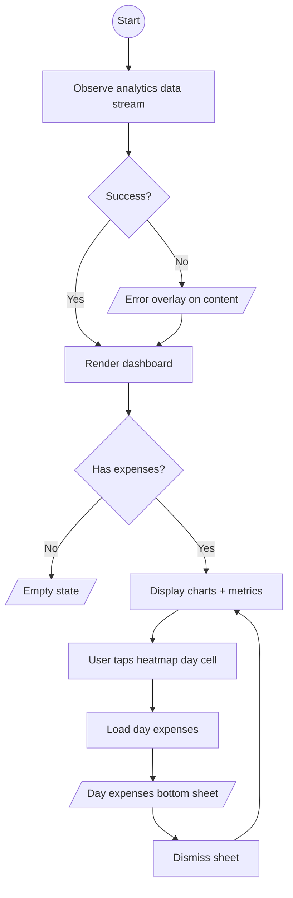

# Analytics Overview

## Purpose

Comprehensive monthly spending dashboard with multiple chart visualizations, budget tracking, and day-level drill-down.

## Process Flow

## Layout

Dashboard cards rendered in a vertical scroll, in order:

1. **Quick Stats Row** — Total Spent, Categories, Active count.
2. **Budget Pulse** — Linear progress bar with burn-rate colour coding and daily allowance. Only shown when a monthly budget is set.
3. **Spending Overview** — Donut pie chart with smart legend (category name, amount, avg daily). Requires 2+ categories with spending (Vico pie chart does not support a single slice).
4. **Daily Spending Trends** — Line chart of daily totals. Optional dashed ghost line showing linear budget pacing when a budget is set.
5. **Spending Heatmap** — Calendar grid (7 columns x weeks) with intensity-coloured cells. Tappable — opens a bottom sheet with that day's expenses.
6. **Monthly Comparison** — Column chart of last 6 months' totals with projected total insight (over/under budget).
7. **Category Breakdown** — Progress bars per category showing percentage of total spending.

## Features

### Charts (Vico library)

All chart model producers live in `AnalyticsScreen` and are driven by `LaunchedEffect` keyed on the extracted amount lists (structural equality) to avoid unnecessary re-animations.

**Known Vico limitations:**
- `CartesianValueFormatter` must never return a blank string — out-of-bounds indices fall back to `value.toInt().toString()`.
- Pie chart crashes or disappears with a single slice — the donut is hidden when `spendingSlices.size <= 1`.

### Spending Heatmap

- Canvas-based rendering with `pointerInput` / `detectTapGestures` for day cell tap detection.
- Tap coordinates are converted to grid (col, row) using pre-computed pixel sizes from `LocalDensity`.
- `onDayTap` callback dispatches `AnalyticsEvent.DayTapped(dayOfMonth)`.

### Day Expenses Bottom Sheet

- Triggered by tapping a heatmap cell.
- Loads expenses for the tapped day via `LoadDayExpensesUseCase` (one-shot suspend, not Flow).
- Shows loading spinner, then a list of expenses (emoji + title + amount) with day label and total.
- Empty state text when no expenses on the selected day.
- Sheet state (`selectedDaySheet`, `isDaySheetLoading`) is preserved across analytics data re-emissions.

### Budget Tracking

- **Burn rate**: colour transitions green → yellow → red based on spend percentage.
- **Daily allowance**: remaining budget divided by remaining days.
- **Projected total**: linear extrapolation from current daily rate.

### Empty State

Displayed when `hasAnyExpenses` is false. Encourages user to add their first expense.

## Navigation

Accessible via the Analytics bottom tab. No outbound navigation — day drill-down uses an in-screen bottom sheet.

## UI States

| State | When |
|-------|------|
| Loading | Initial data fetch |
| Content | All chart and metric data loaded; optionally showing day sheet |
| Error | Fetch failure; previous content preserved with error overlay |

## Events

| Event | Trigger | Effect |
|-------|---------|--------|
| `DayTapped(dayOfMonth)` | Heatmap cell tap | Loads day expenses, shows bottom sheet |
| `DismissDaySheet` | Sheet swipe-down / scrim tap | Hides bottom sheet |

## Domain Operations

| Operation | Type | Description |
|-----------|------|-------------|
| `ObserveAnalyticsDataUseCase` | Flow | Continuous stream of monthly analytics (categories, daily spending, monthly totals) |
| `LoadDayExpensesUseCase` | Suspend | One-shot load of expenses for a specific day |
