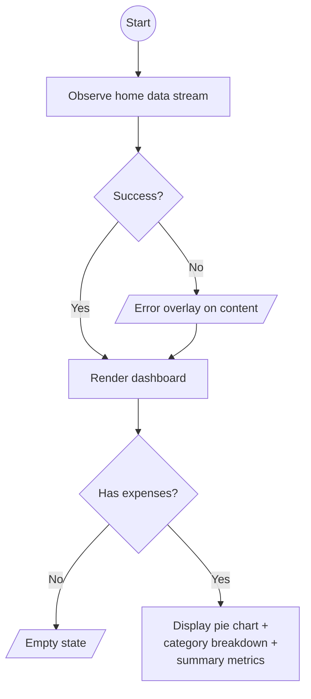

# Analytics Overview

## Purpose

High-level spending dashboard with a pie chart visualization of category-level spending distribution.

## Process Flow

## Layout

- **Pie chart**: Visual breakdown of spending by category, each slice colour-coded.
- **Category list**: Each category with name and formatted amount.
- **Summary stats**: Total spent, total categories, active categories (categories with at least one expense).

## Features

### Spending Pie Chart
- Each category maps to a `SpendingSlice` with name, formatted amount, raw amount, and colour.
- Only categories with spending are shown as slices.
- Provides at-a-glance proportional view of where money goes.

### Category Breakdown
- Lists all categories with their total spending.
- Formatted with user's currency symbol and decimal places.

### Summary Metrics
- **Total spent**: Sum across all categories.
- **Categories count**: Total number of categories.
- **Active categories**: Categories that have at least one expense.

### Empty State
- Displayed when `hasAnyExpenses` is false.
- Encourages user to add their first expense.

## Navigation

Accessible via the Analytics bottom tab. No outbound navigation from this screen.

## UI States

| State | When |
|-------|------|
| Loading | Initial data fetch |
| Content | Chart and category data loaded |
| Error | Fetch failure; content preserved with error overlay |

## Domain Operations

| Operation | Description |
|-----------|-------------|
| Observe home data | Reuses the home data stream for category totals and currency |
