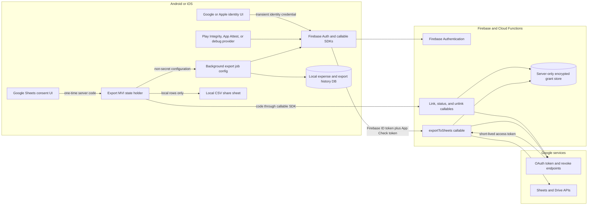
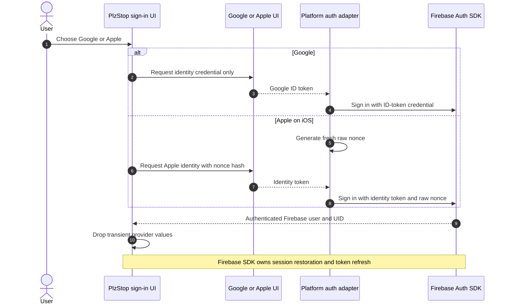
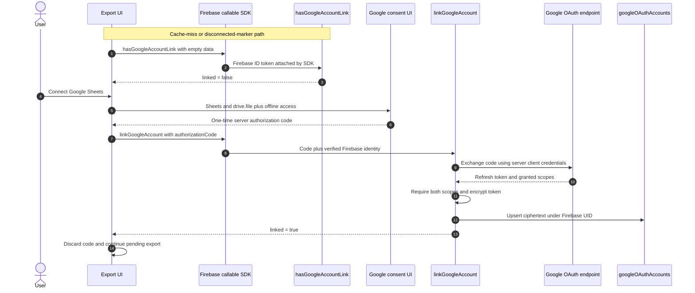
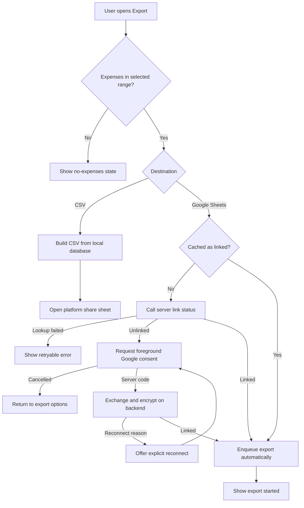
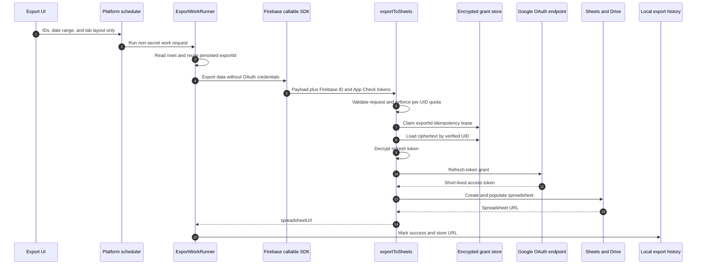
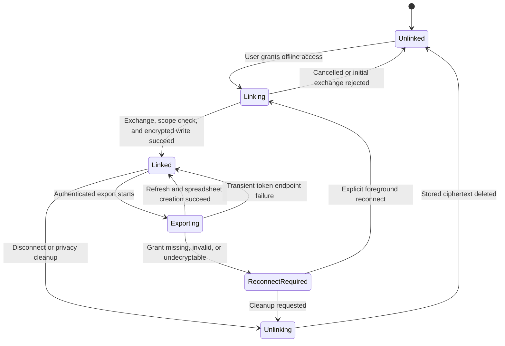
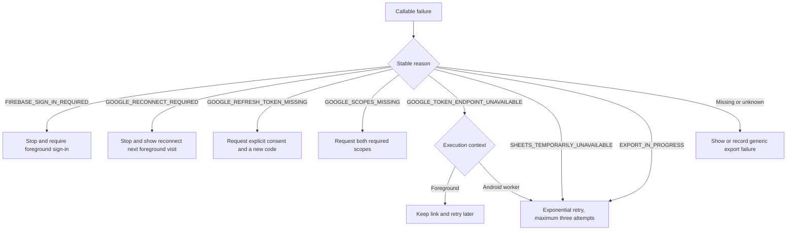

# Export Feature Technical Specification

## Purpose and scope

The export feature sends a selected expense date range either to a user-owned Google Spreadsheet or to a local CSV share
sheet. Google/Apple sign-in authenticates the user to PlzStop through Firebase. Google Sheets authorization is a separate,
incremental permission flow. CSV export is local and has no authentication, OAuth, callable, or Firestore dependency.

This document is the implementation contract for Android, iOS, shared Kotlin, Firebase Auth, callable functions,
Firestore, Google OAuth, and Google Sheets. It supersedes the credential decisions in
`docs/wip/wip_export-to-sheets-plan.md`.

## Security invariants

1. A Google or Apple provider credential is acquired only after an explicit foreground sign-in or reauthentication action.
2. Basic sign-in never requests Google Sheets or Drive scopes.
3. A Sheets connection returns only a one-time server authorization code to shared code.
4. No Google access token, refresh token, Firebase token, authorization code, or nonce is persisted in UI state, local
   storage, WorkManager input, the iOS scheduler, or `exportToSheets` request data.
5. Firebase callable authentication is the only client identity used by the backend; App Check independently verifies
   that requests originate from an attested PlzStop app.
6. The Google Sheets refresh token is durable only as backend-encrypted ciphertext keyed by the verified Firebase UID.
7. A Google Sheets access token exists only in function memory for one export invocation.
8. Export requests use a durable local export ID as a server idempotency key.
9. Link lookup failure is an error/unknown state, not an unlinked state.
10. CSV export remains available without Firebase or Google.

## Architecture



The device-to-backend boundary has no path for a Google Sheets refresh or access token. The callable SDK adds Firebase
authentication and App Check attestation outside the application payload.

### App Check on Apple and Android

- Android Debug builds use Firebase's debug provider. Release builds use Play Integrity.
- Apple Debug builds and the iOS Simulator use Firebase's debug provider. Release builds use App Attest on iOS 14 and
  later, with DeviceCheck fallback for an older supported OS.
- The Apple factory is installed before FirebaseApp.configure(). The App Attest entitlement uses the production
  environment because Firebase does not accept sandbox App Attest assertions.
- Debug tokens are registered manually in Firebase Console and kept out of source control.
- Every callable sets App Check enforcement, so a valid Firebase user without a valid app attestation is rejected.
- App Check identifies a genuine app/device instance; it does not authenticate the user or replace Google/Apple sign-in.

## Credential and token lifecycle

| Value | Acquisition point | Purpose | Durable owner | Disposal or revocation |
|---|---|---|---|---|
| Google ID token | Explicit basic Google sign-in or reauthentication | Build a Firebase Google credential | None | Discard after Firebase accepts/rejects it |
| Google client access token | May be returned incidentally by Google iOS SDK | No PlzStop use | None | Keep inside platform SDK/adapter and discard |
| Google server authorization code | Explicit Sheets consent with offline access | One exchange at `linkGoogleAccount` | None | Discard after one attempt; never replay |
| Apple identity token | Explicit Sign in with Apple or reauthentication | Build a Firebase Apple credential | None | Discard after Firebase accepts/rejects it |
| Apple raw nonce | Generated immediately before each Apple request | Bind Apple response to Firebase request | None | Memory only; clear on success, error, malformed response, or cancellation |
| Firebase ID token | Firebase SDK session | Authenticate callable requests | Firebase SDK | SDK refreshes it; app never puts it in payloads |
| Firebase refresh token | Firebase sign-in | Restore and refresh Firebase session | Firebase SDK | Cleared/invalidated by sign-out, revocation, or account deletion |
| Google Sheets refresh token | Backend exchange of server code | Mint access while user is absent | Backend encrypted store | Revoke/delete on unlink and cleanup; delete when invalid |
| Google Sheets access token | Refresh grant inside `exportToSheets` | Call Sheets/Drive | Function memory | Drop when invocation ends |
| Local Google link marker | Successful link response | Non-secret UX cache | Platform local storage | Delete on unlink/reconnect; never treat as authoritative |

## Federated identity sign-in

### Google

- Android uses Credential Manager and `GetGoogleIdOption`. The request is identity-only and yields
  `GoogleSignInCredential(idToken)`.
- iOS uses Google Sign-In without additional Sheets scopes. Incidental access tokens or server codes do not enter the
  shared result. Firebase receives an ID-token-only `OAuthProvider` credential inside the Swift adapter.
- Shared auth code passes the transient ID token directly to the platform Firebase adapter. It does not connect Sheets.

### Apple

- Apple sign-in exists on iOS only.
- Swift generates a cryptographically random raw nonce and sends its SHA-256 hash to Apple.
- The returned identity token and original nonce are passed once to Firebase.
- The bridge clears the stored callbacks and raw nonce on success, provider error/cancellation, malformed response, and
  Kotlin coroutine cancellation. A later reauthentication creates a new nonce.
- PlzStop does not store or exchange Apple's authorization code and does not hold an Apple export grant.



At application launch, Firebase restores its own session. PlzStop does not silently reopen Google or Apple provider UI.

## Google Sheets connection

The client first checks its encrypted last-known-linked marker. A connected marker skips `hasGoogleAccountLink` and lets
`exportToSheets` validate the refresh token while starting the export. If the marker is missing or disconnected, the
client calls `hasGoogleAccountLink`; a `linked=false` result starts authorization for these two scopes and offline access
with the Web/server client ID:

- `https://www.googleapis.com/auth/spreadsheets`
- `https://www.googleapis.com/auth/drive.file`

Android uses Google Identity Services `AuthorizationClient`. iOS uses Google Sign-In with additional scopes and the server
client ID. Normal connection does not force consent. A reconnect request uses the provider-supported explicit-consent
path so Google can issue a replacement refresh token. Android sets the consent prompt; iOS disconnects the stale Google
grant before starting authorization.

The Sheets authorization result is `GoogleSheetsAuthorizationCode`; it cannot be passed to Firebase sign-in APIs. Thus an
Apple-authenticated user remains the same Firebase UID while connecting any Google account for Sheets.



The backend writes a replacement only after a complete successful exchange. A bad replacement code leaves an existing
valid grant unchanged.

`GOOGLE_RECONNECT_REQUIRED` and `GOOGLE_SCOPES_MISSING` export failures clear the local marker. The next foreground
export therefore returns to the connection flow instead of trusting stale last-known state.

## User export flow



### CSV path

`CSVExportRepository` loads expenses, category names, subcategory names, and decimal precision from the local database,
formats normalized amounts, escapes CSV fields, creates a date-range filename, and invokes the platform `DocumentSharer`.
No link check, notification permission, Firebase session, or network is involved.

### Google Sheets background path

The persisted job contains only:

| Key | Type |
|---|---|
| `exportId` | `Long` |
| `tabLayout` | `String` (`single_tab` or `separate_tabs`) |
| `startDate` | `Long` epoch milliseconds |
| `endDate` | `Long` epoch milliseconds |

Android persists this input in WorkManager with a connected-network constraint, exponential backoff starting at 30
seconds, and at most three token-endpoint attempts. A permanent auth/reconnect result is terminal and does not start
interactive UI. iOS passes the same `ExportWorkRequest` to the shared runner from the application scope; it does not put a
credential in Swift or a durable OS task. Process-termination resilience on iOS therefore remains weaker than WorkManager
and must be evaluated separately if durable iOS background execution becomes a product requirement.

`ExportWorkRunner` reads and formats local data, includes the persisted `exportId`, and calls `exportToSheets`.
Amounts cross the callable boundary as finite numbers rather than strings.



Payloads larger than 100 KiB are gzip-compressed and base64-encoded. The function rejects input above 5,000 rows or
2 MiB after decompression/JSON encoding. A retry with a completed `exportId` returns the existing URL without creating a
second spreadsheet. Active leases return `EXPORT_IN_PROGRESS`; stale leases can be reclaimed.

## Link state machine



The local marker never advances this server state. Every foreground Sheets export checks the server.

## Error and recovery contract

Clients use callable status and `details.reason`; they never parse provider text.

| Status | Stable reason | Foreground behavior | Background behavior |
|---|---|---|---|
| `UNAUTHENTICATED` | `FIREBASE_SIGN_IN_REQUIRED` | Ask user to sign in | Fail terminally |
| `INVALID_ARGUMENT` | `GOOGLE_AUTH_CODE_MISSING` | Start a new authorization operation | Not applicable |
| `FAILED_PRECONDITION` | `GOOGLE_REFRESH_TOKEN_MISSING` | Explicit consent/reconnect | Not applicable |
| `FAILED_PRECONDITION` | `GOOGLE_RECONNECT_REQUIRED` | Clear cached marker and reconnect | Fail terminally; reconnect on next foreground export |
| `PERMISSION_DENIED` | `GOOGLE_SCOPES_MISSING` | Request both exact scopes | Fail terminally |
| `UNAVAILABLE` | `GOOGLE_TOKEN_ENDPOINT_UNAVAILABLE` | Keep current link and retry later | Retry with bounded backoff |



Human messages are generic. Logs may contain HTTP status and stable reason metadata, but never provider bodies, request
codes, tokens, client secrets, encryption keys, or ciphertext.

## Unlink, sign-out, and account deletion

- Explicit Sheets disconnect calls `unlinkGoogleAccount` while Firebase auth is available.
- Sign-out first attempts remote unlink, then always clears the local Google link marker, Firebase session, and Google
  identity SDK state even if unlink is offline. It preserves the local expense database.
- Account deletion first asks Firebase to delete the current user without reopening provider UI. If Firebase requires a
  recent login, the client reauthenticates with only the provider used to sign in to PlzStop and retries deletion. The
  Auth user-deletion trigger attempts revocation of any decryptable remaining grant and always removes the
  `googleOAuthAccounts/{uid}` record; account deletion does not call the unlink callable from the client.
- Google deletion reauthentication filters to accounts already authorized for PlzStop and enables automatic selection.
  Android still shows the system account chooser when more than one eligible credential exists; Firebase rejects a
  credential belonging to a different user. iOS additionally supplies the current Firebase email as the Google hint.
- Token revocation is best effort; ciphertext deletion is mandatory.

```mermaid
sequenceDiagram
    autonumber
    actor User
    participant App as PlzStop client
    participant Firebase as Firebase Auth
    participant Unlink as unlinkGoogleAccount
    participant Google as Google revoke endpoint
    participant Trigger as Auth deletion cleanup

    alt Sign out
        User->>App: Sign out
        App->>Unlink: Best-effort unlink while authenticated
        Unlink->>Google: Best-effort revoke
        Unlink->>Unlink: Delete ciphertext in finally path
        App->>Firebase: Clear local Firebase session
        App->>App: Clear local marker and Google identity state
    else Delete account
        User->>App: Confirm deletion
        App->>Firebase: Delete Firebase user
        opt Firebase requires a recent login
            Firebase-->>App: Reauthentication required
            App->>Firebase: Reauthenticate with current sign-in provider
            App->>Firebase: Retry Firebase user deletion
        end
        Firebase->>Trigger: User deletion event
        Trigger->>Google: Best-effort revoke remaining grant
        Trigger->>Trigger: Delete token record
        App->>App: Clear user data and identity state; preserve default categories
    end
```

## Backend storage and isolation

```text
googleOAuthAccounts/{firebaseUid}
  encryptedRefreshToken: string
  scopes: string[]
  createdAt: timestamp
  updatedAt: timestamp
```

- `firestore.rules` denies all direct client access to this collection, including own-UID reads/writes.
- Only Admin SDK code reads the record.
- The Fernet key and Web OAuth client credentials are Firebase/Google Secret Manager values.
- Only `encryptedRefreshToken` is supported. Development-only records using another field are deleted before rollout.
- A permanent `invalid_grant`, missing ciphertext, missing required scope, or decryption failure deletes the unusable record.
- A transient OAuth endpoint error leaves the record intact.

## Rollout and operational procedures

### Clean rollout with no migration

There are no production users or grant records to preserve. Before the first supported rollout, delete any
development-only `googleOAuthAccounts` records through an Admin SDK/console operation and reconnect test accounts. Deploy
the backend and supported clients together. Do not add a `refreshToken` fallback, migration script, or compatibility
window; this keeps the storage contract single-purpose from the start.

### Encryption-key rotation

1. Retain the old Secret Manager key version and record its version identifier in the restricted incident/change record.
2. Generate a new Fernet key; never print either key or put it in source control, shell history, logs, or job output.
3. Pause link/export writes or deploy a temporary dual-key version that encrypts with the new key and can decrypt with
   new-then-old.
4. Run a controlled Admin SDK re-encryption job: decrypt each ciphertext with the old key in memory, encrypt with the new
   key, write it back, and report only scanned/succeeded/failed counts.
5. Verify every record is readable with the new key before making the new Secret Manager version authoritative.
6. Keep the old key available but disabled from normal runtime during the rollback window. Roll back by restoring the old
   ciphertext set and secret version, never by mixing keys without version metadata.
7. After the rollback window and backup-retention review, destroy access to the old key according to the security policy.

Key rotation is a future ciphertext re-encryption operation and is independent of the initial clean rollout.

### Key loss or unrecoverable ciphertext

Fernet ciphertext cannot be recovered without the original key. Do not attempt to substitute a new key or expose records
for debugging. Disable Sheets export, delete affected token records through an Admin SDK operation that reports counts
only, restore service with a valid new key, and require users to reconnect. Firebase sign-in and CSV export remain usable.

### Google OAuth consent production readiness

Before production release, verify in Google Cloud Console that the OAuth consent screen is in Production/published status,
the app identity and authorized domains are correct, both required scopes are declared, and any required Google sensitive-
scope verification is complete. Testing-mode external-user grants can expire after seven days, so runtime reconnect logic
is not a substitute for publishing the consent configuration. Record console evidence and verification date in the
release checklist; this repository cannot prove console state.

## Implementation map

| Responsibility | Primary implementation |
|---|---|
| Shared credential contracts | `features/auth/google/GoogleSignInCredential.kt`, `GoogleSheetsAuthorizationCode.kt` |
| Android identity and Sheets authorization | `androidMain/.../auth/GoogleAuthUiProviderImpl.kt` |
| iOS Google/Apple provider bridge | `iosApp/iosApp/SocialAuthBridge.swift` |
| Firebase platform adapters | `AndroidFirebaseAuthProvider.kt`, `FirebaseAuthBridge.swift` |
| Link repository/use cases | `GoogleAccountRepositoryImpl.kt`, `ConnectGoogleAccountUseCase.kt` |
| Export UI/MVI | `features/export/presentation/ExportStateHolder.kt` |
| Platform scheduling | `AndroidExportWorkerScheduler.kt`, `IosExportWorkerScheduler.kt` |
| Token-free shared work | `ExportWorkRequest.kt`, `ExportWorkRunner.kt` |
| Callable error mapping | `FirebaseCallableException.kt` and platform callable adapters |
| Backend OAuth and Sheets operations | `functions-py/main.py` |
| Auth-deletion cleanup | `functions/src/userCleanup.ts` |
| Firestore isolation | `firestore.rules` |

## Verification requirements

Automated checks must cover:

- unauthenticated link/export rejection;
- encryption at rest and required-scope validation;
- missing refresh token and non-destructive failed relink;
- invalid-grant deletion and unlink cleanup;
- Firestore client denial for own UID, other UID, and all writes;
- identity-only Google/Apple Firebase session behavior;
- cancellation cleanup for Android pending authorization and iOS Apple callbacks;
- linked/unlinked/lookup-failed distinction;
- structured foreground reconnect and background retry/terminal decisions;
- exact WorkManager/shared scheduler fields and OAuth-credential-free callable payload;
- App Check client initialization and server enforcement;
- idempotent retry, strict payload bounds, numeric amounts, and formula/text separation;
- local sign-out completion when remote unlink fails;
- `encryptedRefreshToken`-only storage with no legacy-field fallback;
- Mermaid rendering for every diagram in this document.

Runtime release checks must additionally exercise Android and iOS provider UI, first consent, repeat export, forced
reconnect, sign-out offline, background execution, and spreadsheet output. The Google OAuth Production status must be
verified separately in Google Cloud Console.
