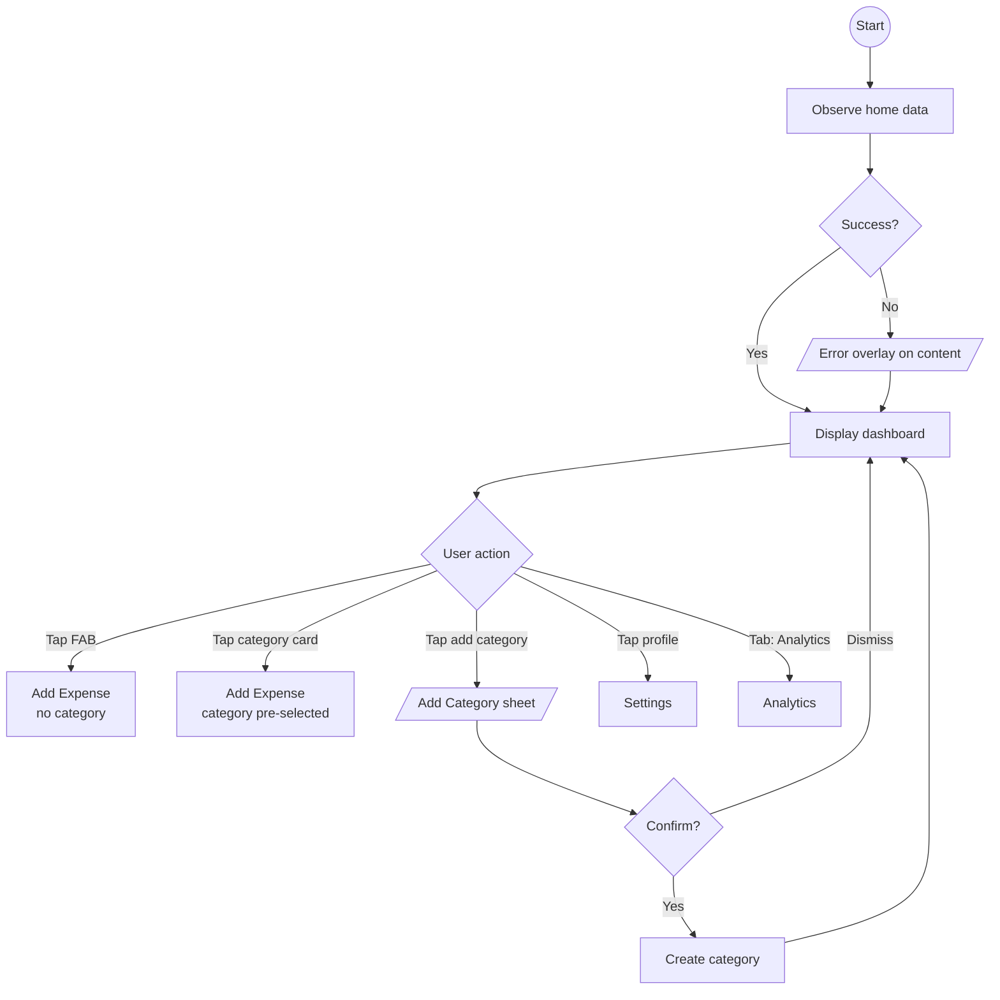

# Home

## Purpose

Primary dashboard screen. Shows the user's total spending, per-category breakdown, and provides quick access to add expenses and categories.

## Process Flow

## Layout

- **Header**: User display name, profile button.
- **Total spending**: Formatted amount in the user's currency.
- **Category grid**: Cards showing each category's name, icon, and formatted spend. Categories with zero spending are visually distinct.
- **FAB**: Floating action button to create a new expense.

## Features

### Spending Overview
- Displays total spending across all categories, formatted with the user's currency symbol and decimal places.
- All amounts are stored in minor units (e.g., cents) and formatted at the presentation layer.

### Category Grid
- Each card shows: icon, name, formatted amount, spending indicator.
- Tapping a category navigates to Add Expense with that category pre-selected.
- Empty-state messaging when no expenses exist yet.

### Add Category
- Triggered via a dedicated button.
- Opens a bottom sheet with a name input field.
- Default icon is `ic_other`.
- On confirmation, the category is created and appears in the grid.

### Quick Add Expense
- FAB opens the Add Expense screen with no pre-selected category.
- Category card tap opens Add Expense with the tapped category pre-selected.

### Profile / Settings Access
- Profile button in the header navigates to Settings.

## Navigation

| Action | Destination |
|--------|-------------|
| Tap category card | Add Expense (category pre-selected) |
| Tap FAB | Add Expense (no category) |
| Tap profile | Settings |
| Bottom tab: Analytics | Analytics screen |

## UI States

| State | When |
|-------|------|
| Loading | Initial data fetch |
| Content | Data loaded, categories visible |
| Error | Fetch failure; content still shown with error overlay for graceful degradation |

## Domain Operations

| Operation | Description |
|-----------|-------------|
| Observe home data | Reactive stream of categories, totals, user info |
| Add category | Create new category with name and default icon |
