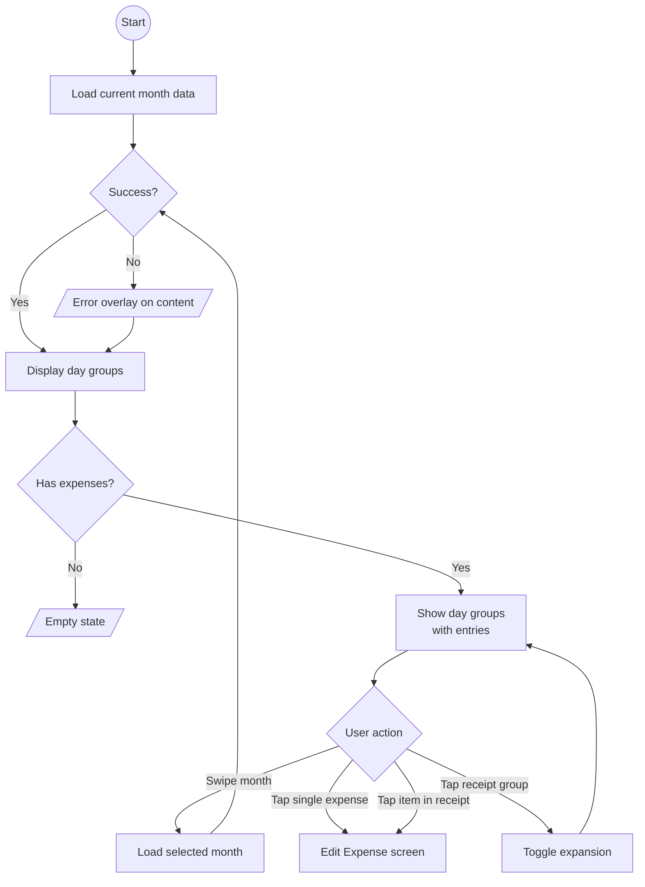

# Monthly Expenses

## Purpose

Detailed chronological view of expenses for a given month, grouped by day, with support for receipt groups and pagination across months.

## Process Flow

## Layout

- **Month selector**: Horizontal pager to navigate between months.
- **Day groups**: Expenses grouped by date, each group showing the day label and day total.
- **Expense entries**: Individual expenses or receipt groups within each day.
- **Month total**: Aggregate for the displayed month.

## Features

### Month Navigation
- Horizontal pager with pre-loaded pages.
- Each page represents one calendar month (year + month).
- Selecting a month triggers data fetch for that period.

### Day Grouping
- Expenses are grouped by calendar day.
- Each group header shows: formatted day label, day total.
- Groups are ordered chronologically.

### Expense Entries

Two types of entries:

| Type | Display | Tap Action |
|------|---------|------------|
| Single expense | Title, category name, category icon, formatted amount | Navigate to Edit Expense |
| Receipt group | Merchant name, item count, total amount, expandable list | Toggle expansion |

### Receipt Groups
- Expenses sharing a receipt ID are grouped under the merchant name.
- Collapsed view: merchant name, item count, total.
- Expanded view: shows individual expense items within the group.
- Expansion state tracked per receipt ID per month.
- Tapping an individual item within an expanded group navigates to Edit Expense.

### Empty State
- Shown when a month has no expenses.

## Navigation

| Action | Destination |
|--------|-------------|
| Tap single expense | Edit Expense screen |
| Tap item in expanded receipt | Edit Expense screen |
| Swipe left/right | Previous/next month |

## UI States (per month page)

| State | When |
|-------|------|
| Loading | Month data being fetched |
| Content | Day groups and expenses loaded |
| Error | Fetch failure; content preserved with error overlay |

## Domain Operations

| Operation | Description |
|-----------|-------------|
| Observe monthly expenses | Reactive stream for a specific year+month, returns day groups with receipt grouping |
