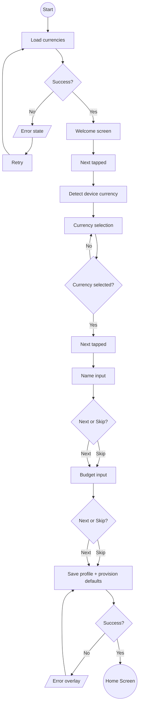

# Onboarding

## Purpose

Multi-step setup wizard that runs on first launch. Collects user preferences (currency, name, budget) and provisions the account before granting access to the main app.

## Process Flow

### Steps

| # | Step | Required | Back | Description |
|---|------|----------|------|-------------|
| 1 | Welcome | Yes | No | Introductory screen |
| 2 | Currency | Yes | No | Select primary currency for all expenses |
| 3 | Name | No (skippable) | Yes | Display name (max 24 chars) |
| 4 | Budget | No (skippable) | Yes | Monthly budget target (0 -- 9,999,999 minor units) |

## Features

### Currency Selection
- Full list of currencies fetched from the server.
- Device locale auto-detection: on transitioning from Welcome to Currency, the app detects the device currency and pre-selects it.
- Bottom sheet picker with search.
- Shows symbol, code, and full name.

### Name Input
- Free-text, trimmed to 24 characters.
- Optional -- user can skip.

### Monthly Budget
- Numeric input respecting the selected currency's decimal places.
- Range: 0 to 9,999,999.
- Optional -- user can skip.

### Completion
- Saves user profile (display name, currency, budget) to the backend.
- Marks onboarding as complete locally so it doesn't re-appear.
- Provisions default categories and subcategories for the account.
- Navigates to the Home screen.

## Error Handling

| Context | Trigger | Behaviour |
|---------|---------|-----------|
| Load currencies | Network/server failure | Error state with retry button |
| Save onboarding | Network/server failure | Error overlay, user can dismiss and retry |

## UI States

| State | When |
|-------|------|
| Loading | Initial data fetch |
| Content | Active wizard with step indicator |
| Error | Unrecoverable load failure |

## Domain Operations

| Operation | Description |
|-----------|-------------|
| Load onboarding data | Fetch available currencies |
| Detect device currency | Read device locale, match to currency list |
| Complete onboarding | Persist profile, mark complete, provision defaults |
