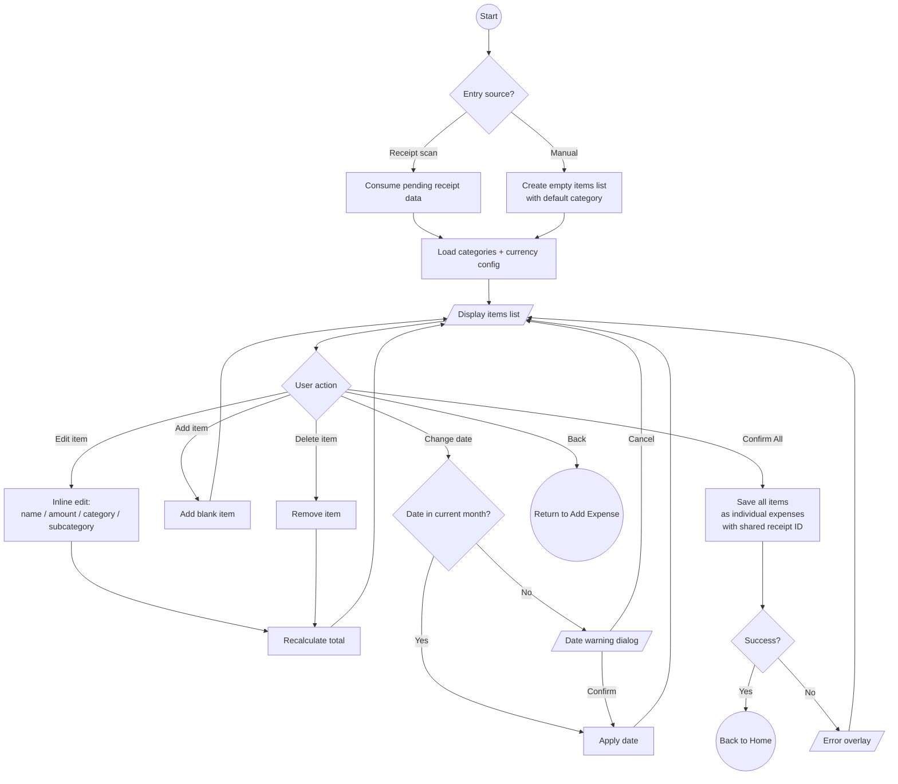

# Receipt Items

## Purpose

Editor for managing individual line items from a scanned receipt (or manually created). Allows reviewing, editing, and batch-saving all items as separate expenses.

## Entry Points

| Source | Data |
|--------|------|
| Receipt scan (with items) | Merchant, date, currency, categorized items from AI analysis |
| Manual receipt creation | Empty items list with pre-selected category |

## Process Flow

## Features

### Item Management
- Each item has: name, amount, category, subcategory.
- Inline editing: tap an item to edit its fields.
- Add new blank items.
- Delete individual items.
- Running total updates as items change.

### Category & Subcategory Assignment
- Each item can have its own category and subcategory.
- Changing a category clears the subcategory for that item.
- Default category/subcategory inherited from the expense form that initiated the receipt.
- AI pre-assigns categories (and subcategories when `subcategories_enabled` flag is ON) per item based on item names.

### Date Management
- Date defaults to the receipt-detected date or today.
- Warning dialog if the selected date falls outside the current month.
- Date picker available for manual override.
- Tracks whether date was auto-assigned from receipt or user-set.

### Currency Conversion
- If the receipt currency differs from the user's primary currency:
  - Conversion summary shown with rate, original total, and converted total.
  - Rate and original currency code carried through to saved expenses.

### Batch Save
- "Confirm All" saves every item as a separate expense in a single operation.
- Each item becomes an individual expense linked by a shared receipt ID.
- Merchant name is associated with all items for receipt grouping in monthly view.

## Form Fields per Item

| Field | Constraints | Required |
|-------|-------------|----------|
| Name | Free text | Yes |
| Amount | Numeric, currency-aware decimals | Yes |
| Category | Picker from user's categories | Yes (defaults provided) |
| Subcategory | Picker, filtered by category (when flag ON) | No |

## Navigation

| Action | Destination |
|--------|-------------|
| Confirm All (success) | Back to Home |
| Back | Return to Add Expense form |

## UI States

| State | When |
|-------|------|
| Loading | Consuming pending receipt data |
| Content | Items displayed, editable |
| Error | Save failure; content preserved with error overlay |

## Domain Operations

| Operation | Description |
|-----------|-------------|
| Consume pending receipt data | Read and clear pending receipt data from local storage |
| Save receipt expenses | Batch save all items as individual expenses with shared receipt ID |
| Observe form data | Get categories, subcategories, currency config |
