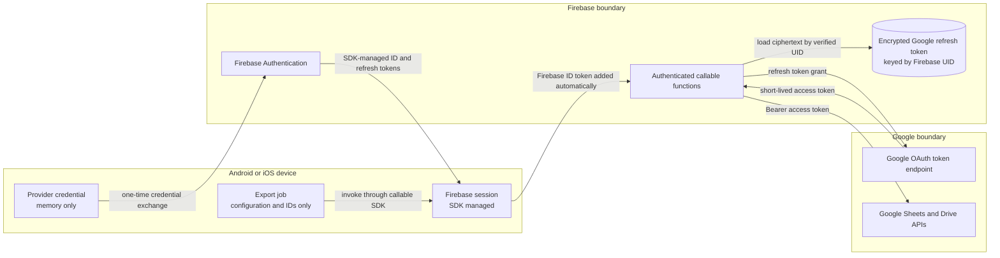
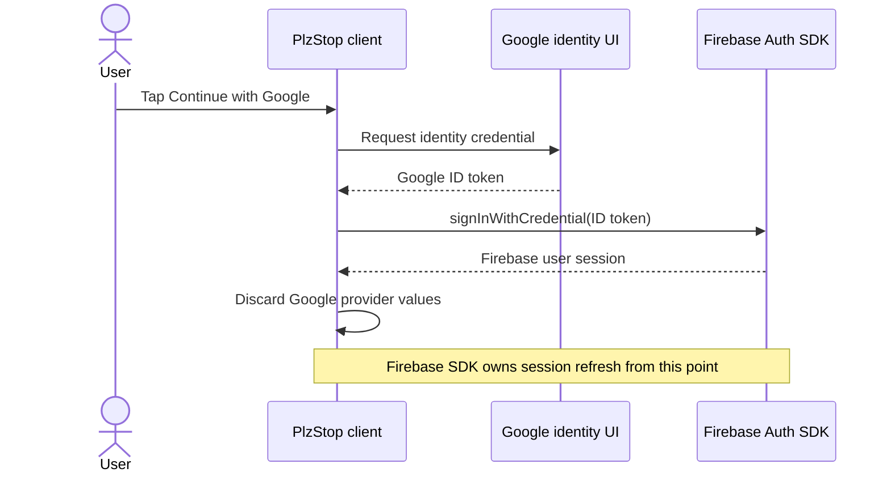
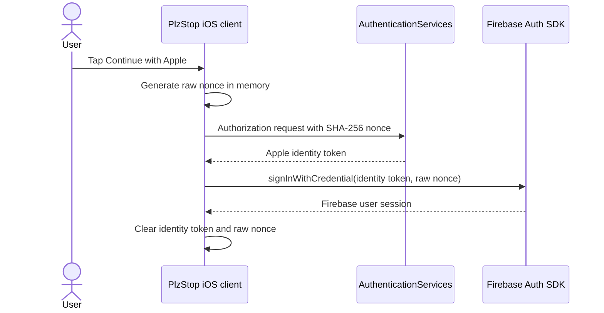
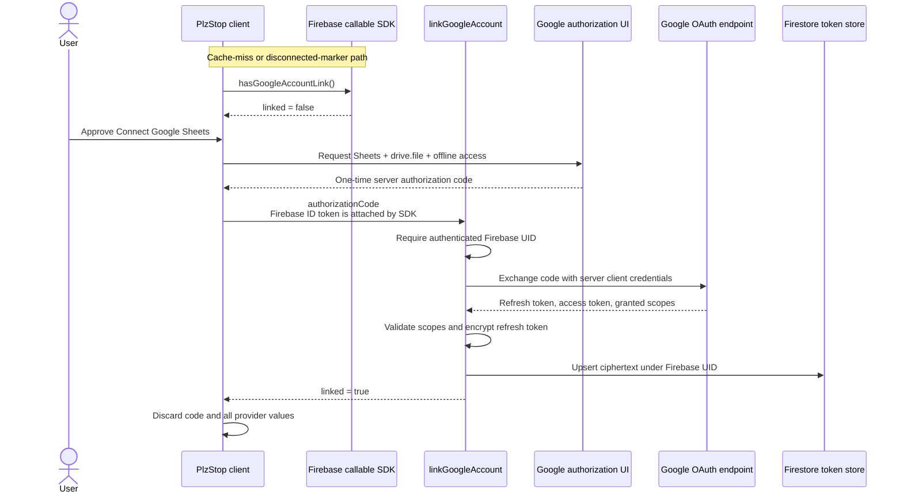
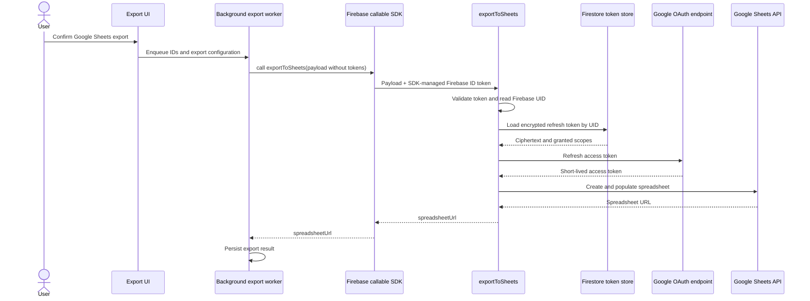
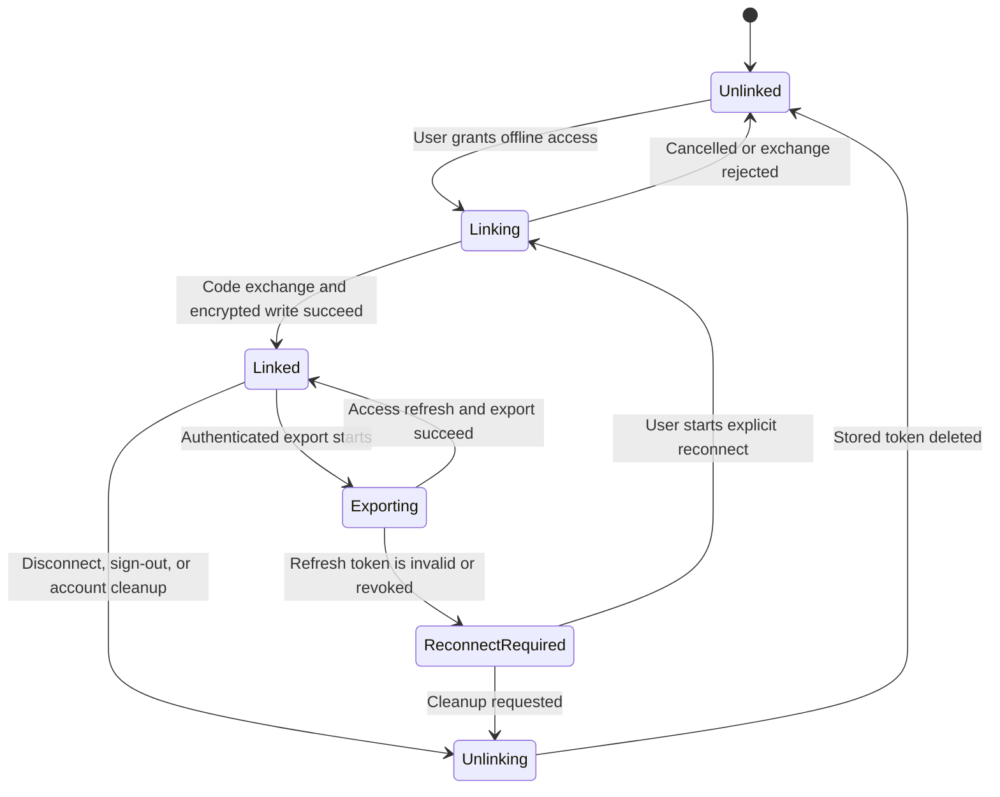

## Context

PlzStop has two independent security concerns:

1. authenticate a person to PlzStop through Firebase Authentication; and
2. obtain permission to create Google Sheets in a Google account.

Those concerns currently overlap in `GoogleUser`, which can carry a Google ID token, client access token, and server
authorization code. The export UI still asks for a client access token even though the worker no longer sends one and
`exportToSheets` now refreshes Google credentials from an encrypted backend token. The published API contract also still
marks `googleAccessToken` as required. This creates ambiguity about which token is authoritative and where a token may be
stored.

The implementation spans Compose Multiplatform shared code, Android Credential Manager and Google Identity Services,
iOS Google Sign-In and AuthenticationServices, Firebase Auth, callable Cloud Functions, Firestore, and the Google OAuth
and Sheets APIs. Android background work can outlive the app process, so no short-lived provider credential can be a
worker input. Apple sign-in is supported on iOS only. Local CSV export remains independent of every auth flow.

## Goals / Non-Goals

**Goals:**

- Give every credential one purpose, owner, acquisition point, storage policy, and deletion policy.
- Keep Google and Apple provider credentials transient and separate from the Firebase session.
- Use incremental Google consent: sign-in asks for identity only; Sheets authorization is requested only when needed.
- Make a Google Sheets export runnable in the background without any provider token supplied by the client.
- Make the backend-held Google refresh token the sole durable credential for Sheets access.
- Define stable reconnect and revocation behavior for expired or withdrawn grants.
- Align the implementation, callable contract, tests, and operational documentation.

**Non-Goals:**

- Changing exported columns, workbook formatting, date-range behavior, or CSV generation.
- Supporting Sign in with Apple on Android.
- Exchanging Apple's authorization code for Apple server access or storing an Apple refresh token.
- Replacing Firebase Authentication or the callable SDK with a custom session protocol.
- Implementing the unrelated `ITokensStorage` custom-backend bearer-token path.
- Giving a service account ownership of user spreadsheets.

## Decisions

### 1. Separate the credential trust domains

Identity-provider credentials prove a recent provider interaction. Firebase credentials authenticate PlzStop calls.
Google OAuth credentials authorize the Sheets API. They are not interchangeable.

| Credential or token | Acquired | Purpose | Durable owner | Disposal |
|---|---|---|---|---|
| Google ID token | After an explicit Google sign-in interaction | Build a Firebase Google credential | None | Discard immediately after Firebase accepts or rejects it |
| Google client access token | May be returned by a Google SDK | No PlzStop use | None | Do not expose outside the platform adapter; discard immediately |
| Google server authorization code | After explicit Sheets consent with offline access | One-time exchange by `linkGoogleAccount` | None | Discard after one exchange attempt; never retry the same code |
| Apple identity token | After an explicit Sign in with Apple interaction | Build a Firebase Apple credential | None | Discard immediately after Firebase accepts or rejects it |
| Apple raw nonce | Generated immediately before Apple sign-in | Bind the Apple response to the Firebase request | None | Keep in memory only; clear on success, cancellation, or error |
| Firebase ID token | Issued and refreshed by Firebase Auth | Authenticate callable requests as a Firebase UID | Firebase client SDK | SDK rotates it; nominal lifetime is one hour |
| Firebase refresh token | Issued after Firebase sign-in | Refresh Firebase ID tokens | Firebase client SDK only | Cleared or invalidated by Firebase sign-out, revocation, or account deletion |
| Google Sheets refresh token | Returned by backend exchange of the server code | Mint Google access tokens while the user is absent | Backend only | Revoke and delete on disconnect/account cleanup; delete when invalid |
| Google Sheets access token | Minted inside a callable for an export | Call Google Sheets/Drive APIs | Function memory only | Drop when the invocation finishes; nominal lifetime is one hour |

The resulting trust boundaries are:



No arrow permits a Google Sheets refresh or access token to cross from the backend to the device.

### 2. Keep Google and Apple sign-in identity-only

Google sign-in requests only the identity scopes required by the provider. Android obtains a Google ID token through
Credential Manager. iOS obtains a Google ID token through Google Sign-In. Any client access token or server code that an
iOS SDK returns incidentally is ignored for sign-in. The ID token is immediately passed to the platform Firebase Auth
adapter and does not enter durable UI or domain state.



On iOS, Apple sign-in creates a cryptographically random raw nonce, sends only its SHA-256 hash to Apple, and passes the
returned identity token plus the original raw nonce to Firebase. Firebase validates the nonce binding. The Apple
authorization code is not needed because PlzStop does not call Apple APIs on the user's behalf.



At app launch, neither provider flow runs. Firebase restores its own session and refreshes its ID token when required. A
fresh provider credential is requested again only for an explicit sign-in or a Firebase operation that requires recent
authentication.

Alternative considered: request Sheets scopes during Google sign-in. This was rejected because it conflates identity
with data authorization, asks for sensitive scopes before the user uses export, and cannot help Apple-authenticated users.

### 3. Authorize Sheets incrementally and exchange the code on the backend

`GoogleAccountLink.isConnected` is a last-known-linked optimization. When it is true, the client skips
`hasGoogleAccountLink` and lets `exportToSheets` authoritatively validate the refresh token. When it is missing or false,
the authenticated `hasGoogleAccountLink` callable checks for a server record. A network failure is an unknown/error state
and MUST NOT be interpreted as "not linked."

When the server reports no link, the foreground client requests exactly these scopes:

- `https://www.googleapis.com/auth/spreadsheets`
- `https://www.googleapis.com/auth/drive.file`

The request also asks for offline access using the Web/server OAuth client ID. Android uses
`AuthorizationRequest.requestOfflineAccess(webClientId)`. iOS configures `GIDServerClientID` and reads
`GIDSignInResult.serverAuthCode`. The client sends only the one-time server authorization code to
`linkGoogleAccount`; the callable SDK separately adds the Firebase ID token.

`linkGoogleAccount` verifies `req.auth`, exchanges the code with the Web client secret, verifies that the returned scope
set covers both required scopes, encrypts the refresh token, and stores it under the verified Firebase UID. It discards
the exchange response's access token and ID token. If the exchange has no refresh token, the link is not recorded and
the client receives a reconnect/consent-required result.

Connecting Google Sheets does not change the Firebase user. In particular, an Apple-authenticated user remains the same
Firebase UID; the Google ID token returned by a combined provider UI is not passed to Firebase during this flow. The
Google account granting Sheets access may therefore be distinct from the provider used to sign in to PlzStop.



Alternative considered: send a client Google access token with every export. This was rejected because access tokens
expire quickly, interactive authorization cannot run in a background worker, WorkManager persists input, and the token
would cross more processes and trust boundaries.

Alternative considered: use a service account and share the resulting spreadsheet. This was rejected because the file
would initially be owned by the service identity, introduces sharing and storage-quota concerns, and does not match the
user-owned-file requirement.

### 4. Refresh a Google access token inside every Sheets export

The foreground flow verifies that the server link exists before enqueueing. The persisted background job contains only
the export ID, date range, tab layout, and other non-secret export configuration. It never contains an ID token, access
token, refresh token, authorization code, or nonce.

The worker invokes `exportToSheets` through the Firebase callable SDK. The SDK obtains a usable Firebase ID token and
attaches it to the request. The callable runtime validates it and exposes `req.auth.uid`. The function uses that UID to
load and decrypt the Google refresh token, performs a refresh-token grant, keeps the returned Google access token in
memory, and creates the spreadsheet.



If the Firebase session is absent or revoked before work runs, the callable returns `UNAUTHENTICATED`; the worker marks
the attempt failed and does not attempt interactive sign-in. If Google returns `invalid_grant` or the stored token cannot
be decrypted, the backend deletes the unusable link and returns a structured `GOOGLE_RECONNECT_REQUIRED` reason. The next
foreground export attempt presents the connection flow.

Alternative considered: manually fetch and cache a Firebase ID token for the worker. This was rejected because callable
SDKs already attach and refresh Firebase credentials and a manually persisted token would expire or duplicate SDK logic.

### 5. Make backend storage authoritative and server-only

The server record is conceptually:

```text
googleOAuthAccounts/{firebaseUid}
  encryptedRefreshToken: string
  scopes: string[]
  createdAt: timestamp
  updatedAt: timestamp
```

- Firestore client rules deny all direct reads and writes to this collection; only Admin SDK code accesses it.
- `GOOGLE_OAUTH_CLIENT_ID`, `GOOGLE_OAUTH_CLIENT_SECRET`, and `GOOGLE_TOKEN_ENCRYPTION_KEY` remain Secret Manager secrets.
- The refresh token is encrypted before the Firestore write. Plaintext exists only during code exchange, refresh,
  revocation, or controlled re-encryption.
- A new valid grant atomically replaces the previous ciphertext. A failed exchange leaves an existing valid link intact.
- The local Google-link record may cache non-secret display state, but it is never accepted as proof of a usable grant.
- Tokens and authorization codes are forbidden in exception messages, logs, crash reports, analytics, tracing attributes,
  database exports, and test snapshots.

There are no production Google grant records or real users to migrate. The first supported rollout writes and reads only
`encryptedRefreshToken`; development-only token records are deleted before rollout and test accounts reconnect. No
legacy field reader, migration job, or compatibility window is shipped. Encryption-key rotation must still re-encrypt
future records while the old key is available. If the key is lost, affected records are deleted and users reconnect;
plaintext recovery is impossible by design.

### 6. Model the Google link as a server state machine



`hasGoogleAccountLink` returns `linked = true` only when the server record exists and its required metadata is valid. It
does not refresh the token when called. Actual refresh remains export-time validation, which avoids unnecessary token
endpoint calls. An invalid refresh transitions the server record to unlinked by deleting it, and the permanent reconnect
result clears the client's last-known-linked marker.

Normal authorization requests do not force a consent screen. A reconnect flow may force explicit consent when the server
lost or invalidated its refresh token; on Android this uses the supported prompt/consent option with offline access. The
same one-time code is never replayed.

### 7. Revoke grants without blocking local sign-out

Explicit Disconnect Google Sheets and account deletion call `unlinkGoogleAccount` while Firebase authentication is
still available. The callable attempts Google's revoke endpoint and deletes the encrypted token even if Google reports
that it was already invalid. Account deletion also has a server-side cleanup path so loss of the client does not leave a
usable refresh token.

PlzStop sign-out follows the current privacy policy and also attempts to unlink Google Sheets before clearing the local
Firebase and Google identity sessions. Failure to reach the unlink callable MUST NOT trap the user in a signed-in state:
local sign-out completes, the grant remains inaccessible without the Firebase UID's authenticated session, and cleanup
is retried when that account next authenticates or by server-side retention cleanup. A later sign-in can therefore require
Sheets reconnection.

Apple identity tokens and nonces are already transient, so there is no Apple export grant to revoke. Revoking the user's
Sign in with Apple relationship itself is outside this export flow.

### 8. Use structured, non-secret error reasons

Callable status communicates transport/auth class; a stable `details.reason` communicates product recovery:

| Callable status | Reason | Client action |
|---|---|---|
| `UNAUTHENTICATED` | `FIREBASE_SIGN_IN_REQUIRED` | Stop background work; ask for sign-in in foreground |
| `INVALID_ARGUMENT` | `GOOGLE_AUTH_CODE_MISSING` | Do not retry the code; restart authorization |
| `FAILED_PRECONDITION` | `GOOGLE_REFRESH_TOKEN_MISSING` | Run explicit Google reconnect/consent flow |
| `FAILED_PRECONDITION` | `GOOGLE_RECONNECT_REQUIRED` | Delete cached link state and reconnect in foreground |
| `PERMISSION_DENIED` | `GOOGLE_SCOPES_MISSING` | Request the exact required scopes again |
| `UNAVAILABLE` | `GOOGLE_TOKEN_ENDPOINT_UNAVAILABLE` | Retry with bounded backoff; no interactive UI in worker |

Human-readable messages remain generic. Provider response bodies and credentials are logged neither on success nor on
failure. Export does not accept an FCM registration token or deliver the spreadsheet URL through notification data.

## Risks / Trade-offs

- **Google refresh tokens can be revoked, expire after long inactivity, or be short-lived while the OAuth consent screen
  is in Testing** -> Publish/verify the consent screen for production, handle `invalid_grant`, delete the stale record,
  and present reconnect in the foreground.
- **A server-held refresh token increases backend impact if Firestore or the encryption key is compromised** -> Deny
  client access, use least-privilege scopes, keep the key in Secret Manager, redact logs, and maintain key-rotation and
  incident-revocation procedures.
- **`spreadsheets` is a broad scope even with `drive.file`** -> Request no additional scopes, clearly explain the export
  purpose at consent, and complete Google's sensitive-scope verification if required.
- **A background export can begin after local sign-out or token revocation** -> Callable authentication and refresh happen
  at execution time; failures are terminal until a foreground sign-in/reconnect.
- **Revocation during offline sign-out cannot be guaranteed immediately** -> Always clear local sessions, keep server
  records UID-scoped, and use subsequent-login/server cleanup as a backstop.
- **Encryption-key loss makes stored grants unrecoverable** -> Back up and rotate secrets operationally; otherwise delete
  affected records and require reconnect.
- **A development client may still send obsolete fields** -> Ignore unknown request fields without consuming or logging
  them as credentials; deploy the server and supported clients together before onboarding users.

## Deployment Plan

1. Delete development-only `googleOAuthAccounts` records before rollout. No production data migration is required.
2. Add backend scope validation, structured error details, and `encryptedRefreshToken`-only storage.
3. Split the shared Google provider result into an identity result and a Sheets authorization result. Remove
   `accessToken` from shared UI/domain models and remove the unused `ConfirmExport(accessToken)` path.
4. Keep basic Google sign-in identity-only. Add/retain a distinct foreground Sheets authorization operation that returns
   only a one-time server code to `ConnectGoogleAccountUseCase`.
5. Ensure Android WorkManager and the iOS scheduler persist only non-secret export configuration. Update negative tests to
   fail if any token-named field appears in worker input or callable export data.
6. Update `export-to-sheets-api.md` to remove `googleAccessToken`, document authenticated link/unlink callables, and add
   the reconnect error contract.
7. Add emulator/unit tests for UID isolation, encryption-at-rest, scope validation, missing refresh tokens, invalid-grant
   cleanup, callable unauthenticated behavior, and token redaction.
8. Runtime-test Google sign-in, Apple sign-in, first Sheets connection, repeat export without consent, revoked-grant
   reconnect, sign-out cleanup, and export after process restart on Android and iOS.

Rollback never restores client access-token transport. If the new client path fails before onboarding users, disable
Google Sheets export while keeping CSV available, revert the callable/client code together, delete development grant
records, and reconnect test accounts after the corrected rollout.

## Open Questions

None. The specification treats PlzStop sign-out as a privacy cleanup that disconnects Google Sheets, matching the current
product behavior. Changing that to an account-persistent integration is a separate product decision.

## External References

- [Firebase callable authentication](https://firebase.google.com/docs/functions/callable)
- [Firebase session lifetimes and revocation](https://firebase.google.com/docs/auth/admin/manage-sessions)
- [Android authorization and offline access](https://developer.android.com/identity/authorization)
- [Google AuthorizationRequest offline-access contract](https://developers.google.com/android/reference/com/google/android/gms/auth/api/identity/AuthorizationRequest.Builder)
- [Google iOS server-side access](https://developers.google.com/identity/sign-in/ios/offline-access)
- [Google OAuth refresh-token expiration](https://developers.google.com/identity/protocols/oauth2)
- [Firebase Sign in with Apple nonce flow](https://firebase.google.com/docs/auth/ios/apple)
